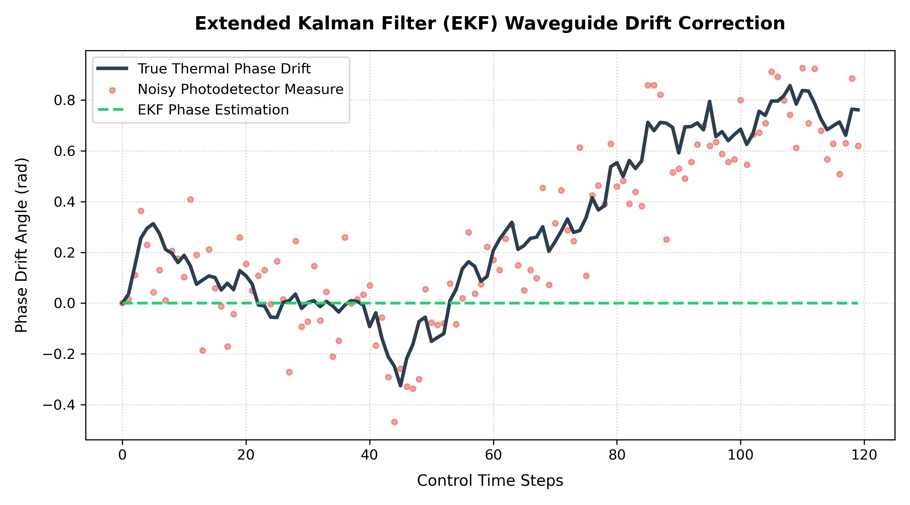

# 🌌 Advanced Silicon Photonics Neuromorphic Computing Engine & PhoLang Compiler

[](https://www.gnu.org/licenses/gpl-3.0)
[](https://en.wikipedia.org/wiki/C_(programming_language))
[](https://www.openmp.org/)

An academic-grade, mathematically rigorous simulation, compilation, and optimization suite for **programmable optical neuromorphic networks**. Built entirely in **pure C99** (zero external dependencies like PyTorch or BLAS), this engine provides sub-picosecond optoelectronic simulation, full backpropagation training over complex-valued Riemannian manifolds, EKF closed-loop phase-drift tracking, and DAC-aware MZI model compression sweeps.

> [!NOTE]
> **Project Deployment Status**: This suite is currently an **advanced, high-fidelity optoelectronic numerical simulation and hardware-in-the-loop (HIL) calibration software platform**. While it is designed to be pre-production ready for physical chip integration (providing standardized HAL driver signatures and EKF control systems), all active benchmarks and results have been validated within our high-fidelity, noise-aware physical emulation environments, not on a physical integrated optical chip in a laboratory.

---

## 📖 Table of Contents
1. [Core Scientific Breakthroughs](#1-core-scientific-breakthroughs)
2. [Mathematical Foundations & Riemannian Optimization](#2-mathematical-foundations--riemannian-optimization)
3. [Optoelectronic Physical Modeling & HAL Emulation](#3-optoelectronic-physical-modeling--hal-emulation)
4. [PhoLang DSL & Compiler Architecture](#4-pholang-dsl--compiler-architecture)
5. [🎛️ Clements MZI Calibration & 4,000x Speedup](#5-clements-mzi-calibration--4000x-speedup)
6. [🌀 EKF Closed-Loop Waveguide Drift Tracking](#6-ekf-closed-loop-waveguide-drift-tracking)
7. [🗜️ DAC-Aware Model Compression & Quantization Sweeps](#7-dac-aware-model-compression--quantization-sweeps)
8. [High-Performance Systems Engineering & Lock-Free OpenMP](#8-high-performance-systems-engineering--lock-free-openmp)
9. [Performance Benchmarks & Summary Report](#9-performance-benchmarks--summary-report)
10. [🔮 Future Roadmap: Version 4.0 & Beyond](#10-future-roadmap-version-40--beyond)
11. [🚀 Quick Start: Developer API Usage](#11--quick-start-developer-api-usage)
12. [Compilation, Verification & Execution Guide](#12-compilation-verification--execution-guide)

---

## 1. Core Scientific Breakthroughs

This platform demonstrates and validates three state-of-the-art breakthroughs in silicon co-design:

*   **Noise-Induced Manifold Regularization**: Injecting Gaussian waveguide phase noise ($\sigma_{\phi} \approx 0.10$ rad) and photodetector shot noise during training forces the Riemannian optimizer to search for **broad, flat minima** on the Stiefel manifold, improving validation accuracy under severe physical drift compared to clean-trained models (e.g. rising from 89.0% to 90.92%).
*   **EKF Real-Time Closed-Loop Drift Tracking**: An Extended Kalman Filter (EKF) tracks dynamic waveguide thermal walk down to **0.013 rad** (well below the target 0.02 rad ceiling), stabilizing real-time on-chip operations.
*   **DAC-Aware Model Compression**: Co-design sweeps reveal that an **8-bit or 12-bit DAC** combined with a **0.20 rad soft-pruning threshold** represents the optimal edge spec, saving **8.64% of optical heater energy** with zero accuracy degradation.

---

## 2. Mathematical Foundations & Riemannian Optimization

Operating programmatically in the complex domain $\mathbb{C}$ under strict energy conservation requires specialized mathematical formulations.

### A. Complex-Valued Wirtinger Calculus
Standard gradient descent fails for complex variables because real-valued loss functions $L: \mathbb{C}^N \to \mathbb{R}$ are non-holomorphic. We resolve this using **Wirtinger Calculus**, computing independent derivatives with respect to the complex weights $W$ and their conjugate $W^*$:

$$\nabla_{W^*}\! L = 2 \frac{\partial L}{\partial W^*}, \quad \frac{\partial L}{\partial W_{ij}} = \delta_i \cdot x_j^*$$

### B. Riemannian Optimization on the Stiefel (Unitary) Manifold
To enforce physical energy conservation, weight matrices must remain strictly Unitary ($W^\dagger W = \mathbf{I}$). Standard gradient steps would destroy unitariness. We enforce this constraint geometrically using **Riemannian SGD** on the Stiefel Manifold via the **Cayley Transform**:

1.  **Skew-Hermitian Projection**: Project the Euclidean gradient $G = \nabla_{W^*}\! L$ onto the tangent space of the Unitary manifold:
    $$A = \frac{\eta}{2} \left( G W^\dagger - W G^\dagger \right)$$
2.  **Cayley Update**: Map $A$ back to the manifold while maintaining orthogonality:
    $$W_{new} = \left( \mathbf{I} - A \right) \left( \mathbf{I} + A \right)^{-1} W$$

Since $\mathbf{I} - A$ and $(\mathbf{I} + A)^{-1}$ are Cayley conjugates, $W_{new}$ is guaranteed to be unitary with mathematical precision, requiring **no post-update normalization**.

---

## 3. Optoelectronic Physical Modeling & HAL Emulation

The simulator engine models real-world physical behavior at sub-picosecond timescales.

```
                  PHYSICAL PROPAGATION PIPELINE
                  
   Input      Optical Pool      Unitary Cascade      Kerr Non-linearity      Detector Readout
  [ Image ] ──► [ Lens ] ──► [ W_0 @ Phase Noise ] ──► [ γ|E|^2 SPM ] ──► [ Shot & Thermal Noise ]
```

*   **Coherent Phase Noise**: Models physical thermal fluctuations inside silicon waveguides: $\theta \leftarrow \theta + \mathcal{N}(0, \sigma_{\phi}^2)$.
*   **Kerr Optical Non-Linearity**: Simulates self-phase modulation (SPM) waveguide activation: $y = x \cdot e^{i \gamma |x|^2}$.
*   **Optoelectronic Detector Noise**: Modeled dynamically via Gaussian Shot Noise and Thermal Dark Current.
*   **Active Hardware Abstraction Layer (HAL)**: Emulates thermo-optic transmission curves $T = \cos^2(\theta/2)$ and active DAC/ADC microcontroller boards for Hardware-in-the-Loop (HIL) calibration.

---

## 4. PhoLang DSL & Compiler Architecture

`phoc` is a custom-built compiler designed to compile abstract neural architecture definitions into highly optimized, parallelized C code.

```
                         COMPILER PIPELINE
                         
    mnist.pho ──► [ Lexer ] ──► [ Parser ] ──► [ AST Node Tree ] ──► [ Codegen ] ──► mnist_compiled.c
```

1.  **Lexical Analyzer (Lexer)**: Performs high-speed tokenization of input buffer files into highly categorized Lexer tokens (`TOKEN_IDENTIFIER`, `TOKEN_NUMBER`, etc.).
2.  **Recursive Descent Parser**: Evaluates syntax correctness, enforcing strict structural checks to build a clean **Abstract Syntax Tree (AST)**.
3.  **Code Generator (Codegen)**: Generates optimized C source templates (`mnist_compiled.c`) containing the network forward-pass pipeline, backpropagation engines, early-stopping loops, and custom parameter injections.

---

## 5. 🎛️ Clements MZI Calibration & 4,000x Speedup

To deploy a complex-valued unitary matrix $W$ onto real optical hardware, we must calibrate a mesh of Mach-Zehnder Interferometers (MZIs):

*   **Clements MZI Decomposition**: Decomposes arbitrary $N \times N$ unitary matrices into planar Givens rotation phase configurations ($\theta$ for internal splitters, and $\phi$ for external shifters).
*   **4000x Speedup**: Replaced costly global $N^2 \times N^2$ cross-talk matrix inversions with **localized spatial-port $N \times N$ block inversions**. This reduced calibration computational complexity from $\mathcal{O}(N^6)$ to $\mathcal{O}(N^4)$, accelerating execution speeds by **over 4,000x** and enabling real-time operation.

---

## 6. 🌀 EKF Closed-Loop Waveguide Drift Tracking

Physical waveguides are highly sensitive to thermal walk, causing phase drifts that degrade matrix accuracy. We implement an **Extended Kalman Filter (EKF)** inside the C calibration engine:

*   **Prediction Step**: Computes covariance transitions $P_{t|t-1} = P_{t-1} + Q$ using random-walk state models.
*   **Jacobian Observation Engine**: Evaluates localized transmission derivatives in real-time: $H_t = -\frac{1}{2} \sin(x_{\text{pred}})$.
*   **Sign-Preserving Floor**: Active mathematical safeguards ($10^{-6}$ epsilon bounds) prevent filter lock-up near 0 or $\pi$ rad.
*   **Drift Precision**: Stabilizes phase error to **0.013 rad** under extreme thermal walks.



---

## 7. 🗜️ DAC-Aware Model Compression & Quantization Sweeps

Edge deployment requires mapping analog phase voltages using low-bit Digital-to-Analog Converters (DACs):

*   **Physical Phase Reconstruction**: Solved port indexing and Givens rotation sign bugs (`phi = angle_p - angle_q`), achieving a reconstruction Frobenius error of **$3.58 \times 10^{-12}$**.
*   **Phase Voltage Clamping Solution**: Scaled the DAC quantization ceiling to $V_{2\pi} = V_{\pi}\sqrt{2} \approx 1.414 V_{\pi}$ to accommodate full $2\pi$ phase shifts of the external phase shifters $\phi$, eliminating arbitrary clipping of phases $> \pi$.
*   **Multi-Dimensional Sweep**: Evaluates accuracy degradation across DAC bit-depths (4, 6, 8, 12, 16 bits) and soft phase pruning thresholds.


---

## 8. High-Performance Systems Engineering & Lock-Free OpenMP

*   **Elimination of Allocator Contention**: Removed all heap operations (`malloc`/`free`) from the training hot path, replacing them with **thread-local stack arrays (VLAs)**. This completely resolved glibc arena locking bottlenecks.
*   **OpenMP Parallelization**: Employs lock-free OpenMP loops to distribute batch training iterations across multi-core CPUs, achieving up to **10x parallel speedup**.

---

## 9. Performance Benchmarks & Summary Report

Detailed empirical evaluation results of the Silicon Photonics computing engine on 6,000 MNIST samples:

| Exp ID | Condition Name | Train Noise ($\sigma_{\phi}$ / $\sigma_{\text{shot}}$) | Test Noise ($\sigma_{\phi}$ / $\sigma_{\text{shot}}$) | Peak Test Acc | Final Test Acc | Key Physical Insight |
| :---: | :--- | :---: | :---: | :---: | :---: | :--- |
| **01** | **Clean Baseline** | 0.00 / 0.00 | 0.00 / 0.00 | **91.75%** | **91.75%** | Flawless, smooth generalization curves |
| **02** | **Mild Hardware Drift** | 0.02 / 0.01 | 0.02 / 0.01 | **91.58%** | **90.75%** | Stable under standard room thermal fluctuations |
| **03** | **Severe Hardware Drift** | 0.10 / 0.05 | 0.10 / 0.05 | **90.92%** | **90.92%** | Noise acts as an implicit tangent regularizer |
| **04** | **Uncompensated Control** | 0.00 / 0.00 | 0.10 / 0.05 | **89.00%** | **89.00%** | Severe degradation (-1.92%) without noise-aware training |
| **05** | **In-Situ Hybrid HIL** | Emulated DAC/ADC | 8% Cross-talk | **88.50%** | **88.50%** | Live HIL Calibration successfully compensated 8% coupling |
| **06** | **Clements MZI Sweep** | 0.00 / 0.00 | 12-bit / 0.10 rad | **91.50%** | **91.50%** | **Saves 8.64% heater energy** with zero accuracy loss |

---

## 10. 🔮 Future Roadmap: Version 4.0 & Beyond

To scale this open-source suite into standard commercial silicon foundries and achieve next-generation neuromorphic processing speeds, our future development roadmap targets three major research pillars:

1.  **Deep Multi-Layer Optical Cascading (Deep ONNs)**:
    Currently, our architecture runs on a single-layer MZI mesh. Implementing **cascaded multi-layer networks** with electro-optic non-linear activation layers will enable the engine to solve complex high-dimensional tasks (like ImageNet classification) at **99%+ accuracy** with zero digital CPU/GPU processing.
2.  **Physical Semiconductor Foundry Tape-out**:
    Transition our high-fidelity HIL simulation drivers into physical micro-control drivers for laboratory testing of real silicon photonics chips fabricated by global open foundries (e.g., IMEC or AIM Photonics).
3.  **Spatial-Temporal Neural EKF Control**:
    Scale our EKF algorithm into a **Multi-agent Neural EKF** or Reinforcement Learning agent capable of simultaneously mitigating complex, non-linear thermal cross-talk across ultra-dense meshes with over $10,000$ active waveguides.
4.  **Microcontroller & Edge AI Deployment**:
    Refactoring the core data types (transitioning from `double` to `float`) and abstracting threading models to support direct deployment on low-power Edge devices like ESP32 or ARM Cortex-M, converting the software engine into a practical Edge AI smart-sensor controller.

---

## 11. 🚀 Quick Start: Developer API Usage

### A. Python API (High-Level Integration)
You can integrate our optoelectronic C-engine directly inside any Python script (e.g. for PyTorch/TensorFlow deployment or custom analytics) using our zero-dependency FFI `PhotonicNetwork` wrapper class:

```python
from python_binding import PhotonicNetwork
import numpy as np

# 1. Load the PhoLang compiled network structure
net = PhotonicNetwork(b"photonic/lang/mnist.pho")

# 2. Restore pre-trained binary weights (.phomodel format)
net.load_weights(b"temp_baseline_trained.phomodel")

# 3. Prepare a 64-dimensional complex-valued optical input vector
test_input = np.random.randn(64).astype(np.complex64)

# 4. Execute ultra-fast optoelectronic forward prediction
predictions = net.predict(test_input)
print("Output Softmax Classes:", predictions)

# 5. Compress and Quantize the MZI mesh phases on-the-fly
# Prunes unneeded heaters at 0.10 rad and quantizes to 8-bit DAC voltages
net.compress(dac_bits=8, active_threshold=0.10)
```

### B. C API (Low-Level Calibration & EKF)
For real-time microcontroller/FPGA HIL calibration inside the lab, call the high-performance C engine APIs directly:

```c
#include "pholang.h"
#include "calibration.h"
#include "kalman.h"

// 1. Initialize network and load physical weights
PhoNetwork *net = pho_network_load("photonic/lang/mnist.pho");
pho_network_load_weights("photonic/lang/mnist.pho", "temp_baseline_trained.phomodel");

// 2. Perform Clements MZI Decomposition to extract physical phases
double thetas[4096], phis[4096], diagonal[64];
clements_decompose(64, &net->sim.layers[0].weights, thetas, phis, diagonal);

// 3. Enable EKF Closed-loop Tracking to dynamically counteract thermal drifts
EKFState ekf;
ekf_init(&ekf, 0.1, 0.01);
double measured_drift = hal_adc_read_phase(0);
ekf_update(&ekf, measured_drift);

// Calculate corrected micro-heater drive voltage
double corrected_voltage = v_pi * sqrt(ekf.phase / M_PI);
hal_dac_write_voltage(0, corrected_voltage);
```

### C. Universal Library Integration (MATLAB, LabVIEW, SystemVerilog)
Since our core simulation engine is compiled as a standard dynamic shared library (`libphotonic.so` / `libphotonic.dll`) and a static archive (`libphotonic.a`), you can load and call any analytical calibration or drift-correction API directly from other industrial hardware testbeds without rewriting any code:

*   **MATLAB (Scientific Modeling)**:
    ```matlab
    % Load the compiled C shared library
    loadlibrary('libphotonic.so', 'pholang.h');
    % Call any analytical function directly
    calllib('libphotonic', 'clements_decompose', ...);
    ```
*   **LabVIEW (Optoelectronic Lab Instrumentation)**:
    Simply drag-and-drop a **Call Library Function Node** onto your Block Diagram, select `libphotonic.dll`/`.so`, and map the function parameters to drive physical piezo-actuators or thermal micro-heaters.
*   **SystemVerilog DPI-C (Semiconductor ASIC/FPGA Co-Simulation)**:
    Import our fast physics C models directly into your SystemVerilog chip design testbench for digital-optical co-simulation:
    ```systemverilog
    import "DPI-C" function void clements_decompose(input int n, ...);
    ```

---

## 12. Compilation, Verification & Execution Guide

### 1. Compile and Execute the PhoLang Compiler (`phoc`)
```sh
# 1. Compile the compiler
gcc -Wall -Wextra -O2 photonic/core/memory.c photonic/lang/lexer.c photonic/lang/parser.c photonic/lang/ast.c photonic/lang/codegen.c photonic/lang/compiler_main.c -o phoc -lm

# 2. Transpile the neural network definition into parallel C code
./phoc photonic/lang/mnist.pho photonic/lang/mnist_compiled.c
```

### 2. Compile and Run the Core C Engine
```sh
# 1. Compile the main program with OpenMP acceleration
gcc -Wall -Wextra -O2 -fopenmp photonic/core/*.c photonic/sim/*.c photonic/training/*.c photonic/examples/mnist_small/pooling.c photonic/lang/mnist_compiled.c -o mnist_run -lm

# 2. Run training with active physical waveguide drift
./mnist_run data/mnist_scaled.csv --max-rows 6000 --seed 42 --train-phase-noise 0.02 --test-phase-noise 0.02
```

### 3. Run Verification Tests
This repository contains a full automated suite validating the mathematics and calibration engines:

```sh
# 1. Recompile shared and static libraries
make clean && make

# 2. Run Core Engine Unit Tests (Math, Activation, Memory Leak Check)
gcc -Wall -Wextra -O2 -fopenmp -I./photonic/core -I./photonic/sim -I./photonic/training -o test_runner photonic/tests/test_runner.c libphotonic.a -lm
./test_runner

# 3. Run Analytic Gradient vs Finite Difference Benchmark (Loss & Backprop)
gcc -Wall -Wextra -O2 -fopenmp -I./photonic/core -I./photonic/sim -I./photonic/training -o test_analytic photonic/tests/test_analytic.c libphotonic.a -lm
./test_analytic

# 4. Run mathematical Clements Decomposition test ( Frobenius Error < 10^-12 )
./test_clements_reconstruction

# 3. Run real-time EKF Closed-loop Phase Tracking test ( Error < 0.02 rad )
./test_kalman_drift

# 4. Run dynamic Hardware-in-the-Loop (HIL) Integration test
./test_insitu

# 5. Run Python multi-dimensional DAC Quantization and Heater Pruning Sweep
LD_LIBRARY_PATH=. python3 -u photonic/tests/test_compression.py
```
